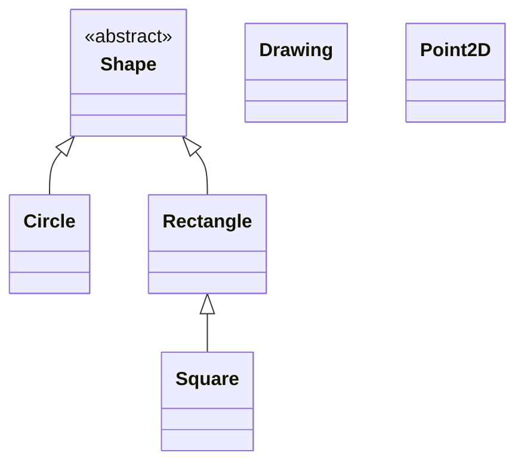

---
layout:
  width: wide
  title:
    visible: true
  description:
    visible: true
  tableOfContents:
    visible: true
  outline:
    visible: true
  pagination:
    visible: true
  metadata:
    visible: true
  tags:
    visible: true
  actions:
    visible: true
---

# Jerarquía de clases para una app de dibujo 2D

En esta práctica diseñaremos e implementaremos una **jerarquía de clases que modele las entidades de una aplicación de dibujo 2D**. La aplicación gestionará un grupo de figuras haciendo uso extensivo de los conceptos de Programación Orientada a Objetos en Python. Para almacenar las colecciones de figuras (o atributos multivariados como los vértices), haremos uso de estructuras de datos integradas de Python, como **listas** o **tuplas**. También exploraremos el uso de **conjuntos (`set`)** para optimizar ciertas operaciones e introducir iteradores personalizados.

Todas las clases formarán parte del paquete `figures` que has inicializado en la primera actividad. Cada una de ellas constituirá un módulo (fichero `.py`) independiente dentro del paquete.

Concretamente, en este proyecto generaremos las siguientes interfaces y clases:

* [**Excepciones de Usuario**](excepciones-definidas-por-el-usuario.md): Definición de clases derivadas de `Exception` para representar errores semánticos personalizados en nuestro dominio.
* [**`Point2D`**](clase-point2d.md): representará un punto bidimensional del espacio cartesiano.
* [**`Shape`**](clase-abstracta-shape.md): clase abstracta, representa el concepto abstracto "figura" o "forma", y actuará de interfaz para definir el comportamiento de formas o figuras concretas.
* [**`Circle`**](clase-circle.md): clase derivada de `Shape`. Representa un círculo.
* [**`Rectangle`**](clase-rectangle.md): clase derivada de `Shape`. Representa un rectángulo.
* [**`Square`**](clase-square.md): clase derivada de `Rectangle`. Representa un cuadrado.
* [**`Drawing`**](clase-drawing.md): representa un dibujo 2D con múltiples figuras. Se encarga de gestionarlas y permite realizar operaciones en lote sobre ellas.

