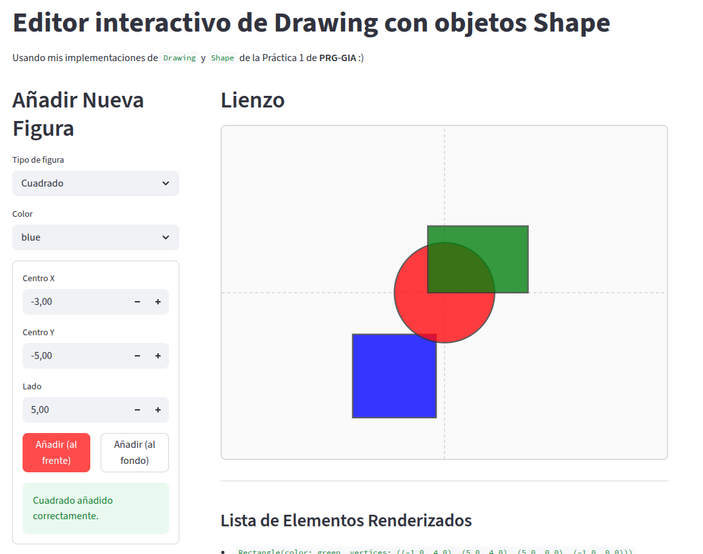
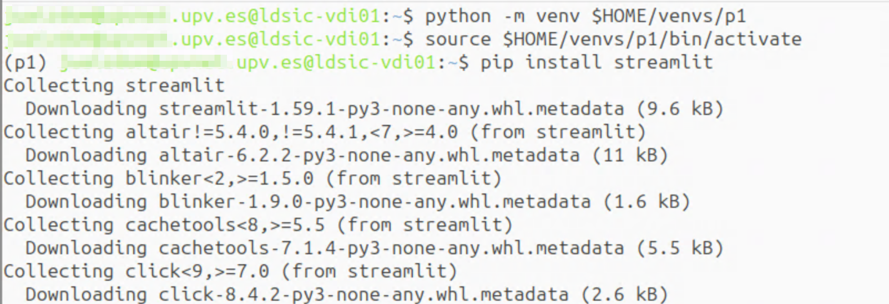

# Opcional: Aplicación web


**ADVERTENCIA IMPORTANTE**

No debes realizar esta actividad ni probar este código si no han pasado satisfactoriamente todos los tests de todas las clases desarrolladas previamente en la práctica, **incluidas las pruebas de la clase `Drawing`**.


Si has completado con éxito toda la jerarquía de figuras bidimensionales y la clase contenedora `Drawing`, puedes probar a integrarlo todo en una bonita y minimalista aplicación web interactiva.

<figure><figcaption></figcaption></figure>

Para ejecutar la aplicación, debes tener instalado el paquete [`streamlit`](https://streamlit.io/) en tu entorno. `streamlit` es una librería de Python que permite crear aplicaciones web interactivas de forma muy sencilla.

Para ello, primero debes crear un entorno virtual de Python, especialmente si estás en el escritorio DSIC-LINUX, ya que no tienes permisos de superusuario para instalar paquetes en el sistema.

Para crear un entorno virtual, ejecuta el siguiente comando en la terminal:


```bash
python -m venv $HOME/venvs/p1
```


Esto creará en el directorio `$HOME/venvs/p1`, el entorno virtual Python de la práctica 1 con el que podrás instalar todos los paquetes que quieras sin interferir con el sistema.


Si estás en polilabs, ese entorno virtual se borrará cuando finalice tu sesión. Por tanto, deberás crearlo de nuevo cada vez que quieras ejecutar la aplicación web.

No se recomienda crear un entorno virtual en el disco `W` para que persista, ya que es un disco de red bastante lento, y además consumirá mucho espacio de tu cuota personal en `W`.


Una vez creado el entorno virtual, debes activarlo. Para ello, ejecuta el siguiente comando en la terminal:


```bash
source $HOME/venvs/p1/bin/activate
```



Para desactivar el entorno virtual, ejecuta el comando `deactivate` en la terminal.


Ahora puedes instalar el paquete `streamlit` en tu entorno virtual ejecutando el siguiente comando en la terminal:


```bash
pip install streamlit
```


<figure><figcaption><p>Creación y activación del entorno virtual, e instalación de streamlit</p></figcaption></figure>

Una vez instalada, crea con vim un fichero llamado `app-web.py` en el directorio raíz de la práctica (en el directorio principal `p1/`, es decir, un nivel por encima de `figures/`) copiando íntegramente el siguiente código.

<details>

<summary>Código completo de app-web.py</summary>


```python
import sys

try:
    import streamlit as st
except ImportError:
    print("Por favor, instala streamlit para ejecutar la interfaz gráfica:")
    print("pip install streamlit")
    sys.exit(1)

from figures import Point2D, Circle, Rectangle, Square, Drawing

def render_svg(drawing, bbox_width=800, bbox_height=600, scale=30):
    """
    Renderiza la lista de figuras en un canvas SVG responsivo.
    Escalamos las posiciones de las figuras para mejor visualización.
    """
    svg = f'<svg viewBox="0 0 {bbox_width} {bbox_height}" style="width: 100%; height: auto; border: 2px solid #ddd; border-radius: 8px; background-color: #fafafa;">\n'
    
    # Aplicar transformación: el centro es el punto 0,0 y el eje Y se invierte hacia arriba
    svg += f'<g transform="translate({bbox_width/2}, {bbox_height/2}) scale(1, -1)">\n'
    
    # Ejes de referencia (cruz en el centro)
    svg += f'<line x1="-{bbox_width/2}" y1="0" x2="{bbox_width/2}" y2="0" stroke="#ccc" stroke-dasharray="5,5" stroke-width="1.5"/>\n'
    svg += f'<line x1="0" y1="-{bbox_height/2}" x2="0" y2="{bbox_height/2}" stroke="#ccc" stroke-dasharray="5,5" stroke-width="1.5"/>\n'
    
    # Obtener el atributo privado _Drawing__shapes
    shapes = getattr(drawing, "_Drawing__shapes", [])
    
    # Renderizar en orden inverso (el inicio es el fondo)
    for shape in reversed(shapes):
        color = shape.color
        
        if isinstance(shape, Circle):
            cx = shape.center.x * scale
            cy = shape.center.y * scale
            r = shape.radius * scale
            svg += f'<circle cx="{cx}" cy="{cy}" r="{r}" fill="{color}" stroke="#333" stroke-width="2.5" opacity="0.8"/>\n'
            
        elif isinstance(shape, (Rectangle, Square)):
            pts = []
            for point in shape.vertices:
                # Cada punto a SVG
                pts.append(f"{point.x * scale},{point.y * scale}")
            pts_str = " ".join(pts)
            svg += f'<polygon points="{pts_str}" fill="{color}" stroke="#333" stroke-width="2.5" opacity="0.8"/>\n'
            
    svg += '</g>\n</svg>'
    return svg

def main():
    st.set_page_config(page_title="PRG-GIA (P1): Editor de Drawing", layout="wide")
    
    if "drawing" not in st.session_state:
        st.session_state.drawing = Drawing()
    
    st.title("Editor interactivo de Drawing con objetos Shape")
    st.markdown("Usando mis implementaciones de `Drawing` y `Shape` de la Práctica 1 de **PRG-GIA** :)")

    col1, col2 = st.columns([1, 2.5], gap="large")
    
    with col1:
        st.header("Añadir Nueva Figura")
        
        fig_type = st.selectbox("Tipo de figura", ["Círculo", "Rectángulo", "Cuadrado"])
        color = st.selectbox("Color", ["red", "green", "blue"])
        
        # Opciones para Círculo
        if fig_type == "Círculo":
            with st.container(border=True):
                cx = st.number_input("Centro X", value=0.0, step=1.0)
                cy = st.number_input("Centro Y", value=0.0, step=1.0)
                radius = st.number_input("Radio", value=3.0, min_value=0.1, step=1.0)
                
                colA, colB = st.columns(2)
                with colA:
                    btn_front = st.button("Añadir (al frente)", type="primary", use_container_width=True, key="circ_f")
                with colB:
                    btn_back = st.button("Añadir (al fondo)", type="secondary", use_container_width=True, key="circ_b")
                    
                if btn_front or btn_back:
                    try:
                        c = Circle(color, Point2D(cx, cy), radius)
                        if btn_front:
                            st.session_state.drawing.add_front(c)
                        else:
                            st.session_state.drawing.add_back(c)
                        st.success("Círculo añadido correctamente.")
                    except Exception as e:
                        st.error(f"Error: {e}")
                        
        # Opciones para Rectángulo
        elif fig_type == "Rectángulo":
            with st.container(border=True):
                cx = st.number_input("Centro X", value=0.0, step=1.0)
                cy = st.number_input("Centro Y", value=0.0, step=1.0)
                w = st.number_input("Ancho", value=8.0, min_value=0.1, step=1.0)
                h = st.number_input("Alto", value=4.0, min_value=0.1, step=1.0)
                
                colA, colB = st.columns(2)
                with colA:
                    btn_front = st.button("Añadir (al frente)", type="primary", use_container_width=True, key="rect_f")
                with colB:
                    btn_back = st.button("Añadir (al fondo)", type="secondary", use_container_width=True, key="rect_b")
                    
                if btn_front or btn_back:
                    try:
                        hw, hh = w / 2, h / 2
                        # rectangle espera Tl, Tr, Br, Bl
                        tl = Point2D(cx - hw, cy + hh)
                        tr = Point2D(cx + hw, cy + hh)
                        br = Point2D(cx + hw, cy - hh)
                        bl = Point2D(cx - hw, cy - hh)
                        r = Rectangle(color, (tl, tr, br, bl))
                        
                        if btn_front:
                            st.session_state.drawing.add_front(r)
                        else:
                            st.session_state.drawing.add_back(r)
                        st.success("Rectángulo añadido correctamente.")
                    except Exception as e:
                        st.error(f"Error: {e}")
                        
        # Opciones para Cuadrado
        elif fig_type == "Cuadrado":
            with st.container(border=True):
                cx = st.number_input("Centro X", value=0.0, step=1.0)
                cy = st.number_input("Centro Y", value=0.0, step=1.0)
                side = st.number_input("Lado", value=5.0, min_value=0.1, step=1.0)
                
                colA, colB = st.columns(2)
                with colA:
                    btn_front = st.button("Añadir (al frente)", type="primary", use_container_width=True, key="sq_f")
                with colB:
                    btn_back = st.button("Añadir (al fondo)", type="secondary", use_container_width=True, key="sq_b")
                    
                if btn_front or btn_back:
                    try:
                        hs = side / 2
                        tl = Point2D(cx - hs, cy + hs)
                        tr = Point2D(cx + hs, cy + hs)
                        br = Point2D(cx + hs, cy - hs)
                        bl = Point2D(cx - hs, cy - hs)
                        s = Square(color, (tl, tr, br, bl))
                        
                        if btn_front:
                            st.session_state.drawing.add_front(s)
                        else:
                            st.session_state.drawing.add_back(s)
                        st.success("Cuadrado añadido correctamente.")
                    except Exception as e:
                        st.error(f"Error: {e}")
                        
        if st.button("🗑️ Limpiar el lienzo", use_container_width=True):
            st.session_state.drawing = Drawing()
            
        st.divider()
        st.header("Operaciones con Drawing")
        
        with st.expander("Trasladar todos los cuadrados: *move_squares()*", expanded=True):
            incX = st.slider("Incremento X", -20.0, 20.0, 0.0, 1.0)
            incY = st.slider("Incremento Y", -20.0, 20.0, 0.0, 1.0)
            if st.button("Trasladar cuadrados", use_container_width=True, key="move_btn"):
                st.session_state.drawing.move_squares(incX, incY)
                st.success(f"Cuadrados trasladados ({incX}, {incY})")
                
        with st.expander("Área de círculos: *get_area_all_circles()*", expanded=True):
            if st.button("Calcular área total", use_container_width=True, key="area_btn"):
                area = st.session_state.drawing.get_area_all_circles()
                st.info(f"Área total acumulada: **{area:.4f}**")
                
        with st.expander("Eliminar duplicados: *remove_duplicates()*", expanded=True):
            if st.button("Eliminar figuras duplicadas", use_container_width=True, key="rem_btn"):
                st.session_state.drawing.remove_duplicates()
                st.success("Posibles duplicados eliminados.")
            
    with col2:
        st.header("Lienzo")
        # Mostrar el Lienzo en un bloque independiente
        shapes = getattr(st.session_state.drawing, "_Drawing__shapes", [])
        
        if not shapes:
            st.info("El lienzo está vacío. Añade una figura para comenzar a dibujar.")
            
        # Llamar y pintar el código SVG directamente
        svg_code = render_svg(st.session_state.drawing)
        st.markdown(svg_code, unsafe_allow_html=True)
        
        # Breve lista de figuras textual debajo del lienzo
        if shapes:
            st.write("---")
            st.subheader("Lista de Elementos Renderizados")
            for i, shape in enumerate(shapes):
                 st.write(f"- `{shape}`")


if __name__ == "__main__":
    main()
```


</details>

Después, ejecútalo desde el directorio principal del proyecto con el comando:


```bash
streamlit run app-web.py
```


Esto lanzará un servidor local y abrirá automáticamente una pestaña en tu navegador web donde podrás interactuar visualmente con las figuras.


La primera vez que ejecutes streamlit, antes de lanzar la pestaña en el navegador, te preguntará por una dirección de e-mail. Pulsa simplemente `Enter` para saltar esta pregunta.

